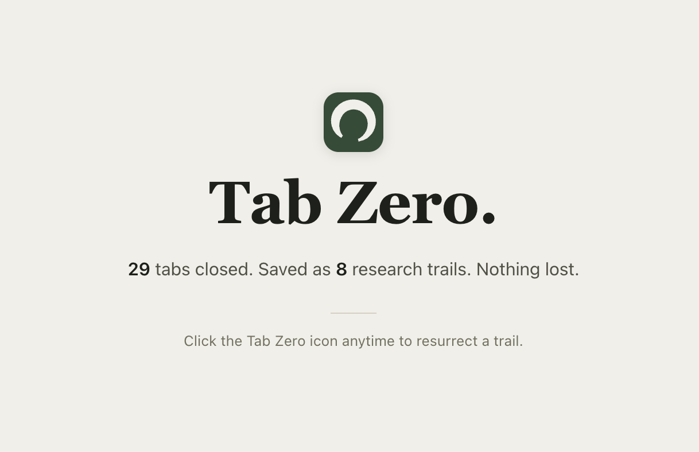
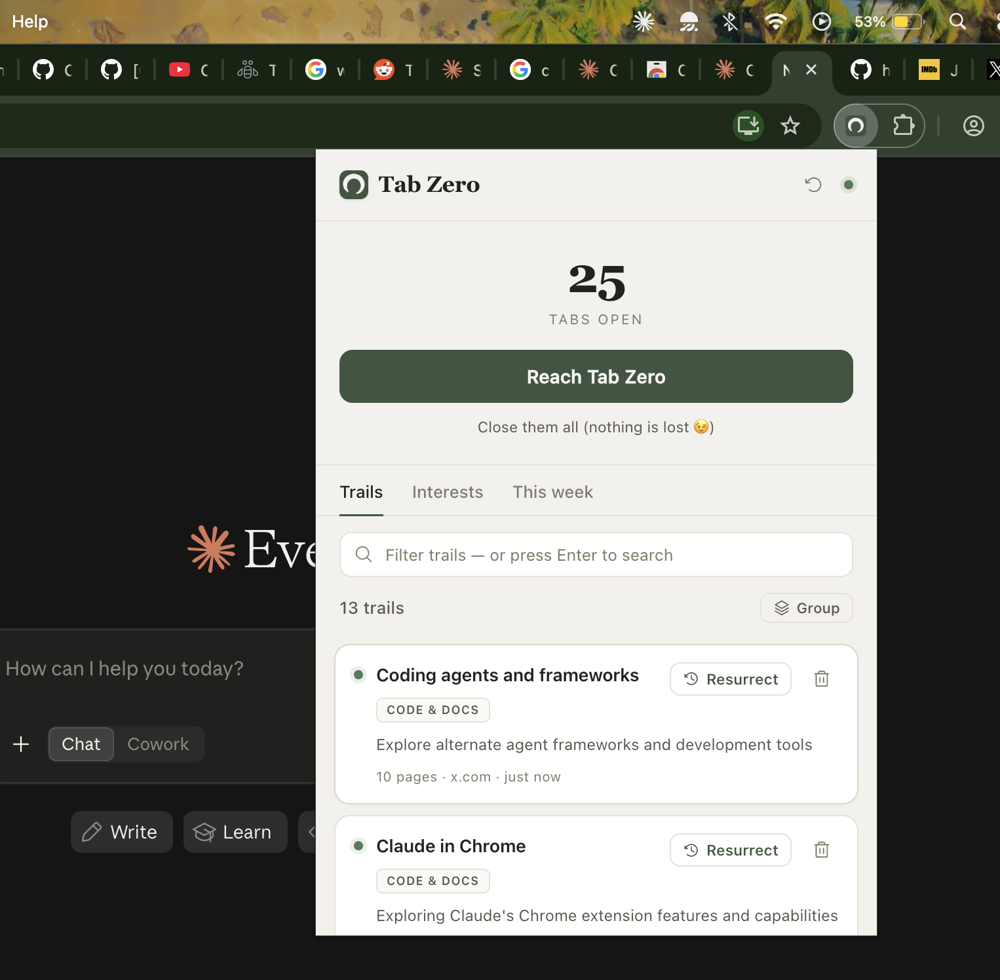

<div align="center">


# Tab Zero

**Close every tab guilt-free. Your browser remembers _why_ each one was open and you or your AI agent can resurrect the research trail on command.**

_Reconciled memory powered by [Weaviate Engram](https://weaviate.io/product/engram)._



</div>

---

Tab Zero watches your tab stream, reconciles it into semantic **research trails** and lets you:

- **Reach Tab Zero** — nuke every open tab in one click. Nothing is lost; every trail stays reconstructable.
- **Resurrect** — reopen the exact tab constellation of any past trail, with a recap of _where you left off and what you concluded_.
- **Search by meaning** — type to filter instantly; press Enter to search your whole memory semantically. Results are tagged `TEXT` (your words matched) or `MEANING`.
- **Research interests** — the themes you keep returning to _across_ trails, synthesized by Engram. Not "a trail you visited twice".
- **Query it from your agents** — a `tabzero` CLI exposes your browsing memory to Claude Code, Codex, opencode, or any agent with a shell.
- **Your week in tabs** — deepest rabbit hole, most-abandoned trail, 3am incident, etc.

The exact-reopen source of truth is a local SQLite log; the reconciled, evolving memory lives in **Weaviate Engram**.

<div align="center">

</div>

---

## How it works

```
Chrome extension (MV3)  ──localhost HTTP──▶  Node daemon  ──▶  SQLite (raw log + trails)
  capture + popup UI                          reconcile         └▶ Weaviate Engram (reconciled memory)
                                              decay + LLM        └▶ OpenRouter / local `claude -p`
        any agent (Claude Code / Codex / opencode) ──`tabzero` CLI──▶  same daemon, same DB
```

- **Local layer** (SQLite) = instant trails + exact-reopen truth + decay. Runs in real time, fully offline.
- **Engram** = cross-time reconciliation (one bounded, evolving memory per trail) + semantic recall + agent-queryable memory. Catches up asynchronously.
- The **LLM** (OpenRouter, or your local `claude -p`) only names trails and writes recap summaries at times, never in the hot path.

Every heuristic — canonicalize, dedup, sessionize, cluster, decay — is math on-device.

---

## Prerequisites

- **Node ≥ 22.5** (uses the built-in `node:sqlite`) and **pnpm**.
- Optional — a **Weaviate Engram** project + API key for the memory layer. Without it, Tab Zero runs in **local mode**: trails, keyword search, categories, gated interests, and "your week in tabs" all still work.
- Optional — an **LLM** for prose. If `OPENROUTER_API_KEY` is set it's used; otherwise Tab Zero shells out to a local **`claude`** (`claude -p`) if installed; otherwise it falls back to heuristic labels/summaries.

---

## Quick start

```bash
npx github:prajjwalyd/TabZero
```

Tab Zero is distributed **straight from this repo**: `npx` installs from a git URL, and a `prepare` script compiles the daemon and bundles
the extension on your machine. You need Node ≥ 22.5 and nothing else.

A guided wizard then stages the extension, takes a [Weaviate Engram key](docs/engram.md), and starts the daemon. Then:

1. Open `chrome://extensions` (Chrome, Edge, Brave, Arc…) and enable **Developer mode**.
2. **Load unpacked** → the folder the wizard printed (`~/.tabzero/extension`).
3. Pin **Tab Zero**, click it, and browse a bit — trails appear automatically.

No key needed to start. Setup also makes `tabzero` a bare command (`npm i -g github:prajjwalyd/TabZero`),
so afterwards it's just `tabzero start` · `tabzero key` · `tabzero path` · `tabzero uninstall` · `tabzero help`.

`tabzero uninstall` stops Tab Zero running — it removes the staged extension copy and the global command
— but **keeps every trail**. Reinstalling resumes from the same database, the same Engram memories, and the
same saved key, because all of it lives in the data dir. To erase it instead: `tabzero uninstall --purge`
(add `--yes` to skip the prompt, the only way to script it).

### Run from source (dev)

```bash
pnpm install
pnpm build:server        # compiles the daemon + CLI -> server/dist
pnpm build:ext           # bundles the extension -> extension/dist
pnpm backend             # start the daemon (keep it running)
```

Load unpacked from `extension/dist`. Dev loop: `pnpm watch:ext` + `pnpm backend:dev`.

`pnpm install` runs the same `prepare` build, so the `tabzero` command works from a clone straight away:

```bash
node bin/tabzero.js setup     # from the repo root — also runs `npm link` so `tabzero` works anywhere
tabzero trails                # …and then the agent commands below work from any directory
```

Clone only to *develop* Tab Zero. To use it, `npx github:prajjwalyd/TabZero` is the whole story.

**Demo data** (for screenshots / a first look, run with the daemon stopped):

```bash
pnpm seed                # add realistic demo trails on top of what's there
pnpm seed --reset        # wipe events/pages/trails first, then seed
pnpm seed --reset --enrich   # also run the LLM label + recap pass inline
pnpm reset               # full fresh start: wipe the local DB (new user_id on next boot)
```

**Repairing a database from an older build** (dry run by default, so it shows you the diff first):

```bash
pnpm repair              # report what it would change, write nothing
pnpm repair --apply      # back up, then fix it
```

---

## Connect Engram

Engram turns Tab Zero's memory from local placeholders into a **reconciled, evolving, semantic** layer. Full setup (project + the two topics + descriptions to paste) is in **[docs/engram.md](docs/engram.md)** — the short version:

Create two topics at [console.weaviate.cloud/engram](https://console.weaviate.cloud/engram):

| Topic | User-scoped | Property scope | Bounded | Role |
|---|:---:|---|:---:|---|
| `TrailSummary` | ✅ | `trail_id` | ✅ | one evolving recap per trail |
| `ResearchInterest` | ✅ | _(none)_ | ✅ | durable cross-trail interests |

Then `tabzero key`, paste your `eng_…` key, and restart the daemon. The popup's status-dot tooltip will read `engram on`, search results tagged **MEANING** (green) are coming from Engram, and the **Interests** tab fills in as Engram synthesizes themes across your trails.

---

## Use your browsing memory from any agent

There's no plugin to install and nothing to restart: any agent with shell access can query your trails through the `tabzero` command. Point it at these once (a line in `CLAUDE.md`, `AGENTS.md`, or your system prompt) and it can pull your browsing memory on demand.

| Command | What it does |
|---|---|
| `tabzero search [query]` | Natural-language search over your trails (empty query lists all) |
| `tabzero trails [--all]` | Every trail, newest first; `--all` also includes archived (quiet >30 days) |
| `tabzero trail <id\|query>` | One trail's recap + its page list |
| `tabzero resurrect <query>` | Recap + the exact URLs to reopen, from a query or id |
| `tabzero week` | The vanity stats (rabbit holes, abandoned trails, 3am incidents…) |
| `tabzero interests` | The durable themes you keep returning to across many trails |

Add `--json` to any of them for machine-readable output:

```bash
tabzero search "gpu pricing" --json
```

They query the running daemon over HTTP, so `tabzero start` has to be up (it needs to be anyway, to
capture anything). Exit code is non-zero with a message on stderr when it isn't.

`tabzero` becomes a bare command when `setup` runs — `npm i -g github:prajjwalyd/TabZero`, or `npm link`
when it detects it's running inside a clone. Before that, `npx github:prajjwalyd/TabZero <cmd>` works too.

Try it with any agent: _"resurrect my GPU pricing research"_ · _"what's my most abandoned trail this week?"_ · _"what have I been into lately?"_

---

## Your week in tabs

Wrapped-style stats derived entirely from tab metadata — deepest rabbit hole, boomerang page, biggest time sink, most-abandoned trail, late-night incident, tab-hoarding peak. Screenshot bait for the launch follow-up.

---

## Configuration

Env vars (all optional). In dev they load from `.env` at the repo root; installed, from `~/.tabzero/.env`.

| Var | Default | Purpose |
|---|---|---|
| `ENGRAM_API_KEY` | — | Weaviate Engram key (reconciled memory) — [setup guide](docs/engram.md) |
| `OPENROUTER_API_KEY` | — | Use OpenRouter for the LLM instead of local `claude` |
| `OPENROUTER_MODEL` | `deepseek/deepseek-v4-flash` | Chat model when using OpenRouter |
| `TABZERO_CLAUDE_MODEL` | `haiku` | Model alias for the local `claude -p` path |
| `TABZERO_USER_ID` | _(generated)_ | Pin the user / Engram scope; bump it for a clean slate |
| `TABZERO_TRAIL_TOPIC` | `TrailSummary` | Match a differently-named recap topic |
| `TABZERO_INTEREST_TOPIC` | `ResearchInterest` | Match a differently-named interest topic |
| `TABZERO_PORT` | `8787` | Daemon port — also set `BACKEND` in `extension/src/config.ts` and rebuild |
| `TABZERO_TOKEN` | _(generated)_ | Pin the extension↔daemon secret; by default a random one is minted per install into `<data dir>/token` |
| `TABZERO_ENGRAM_TIMEOUT_MS` | `15000` | Hard cap on any Engram call so a slow endpoint can't hang the daemon |
| `TABZERO_DEBUG` | — | Set to `1` for verbose Engram retrieval logs |
| `TABZERO_RESURRECT_MAX_TABS` | `25` | Hard cap on how many tabs one **Resurrect** may reopen |
| `ENGRAM_BASE` | `https://api.engram.weaviate.io/v1` | Engram API base. **Must be `https://`** (loopback excepted) — it's validated at boot, because every request carries your API key alongside your page titles |

Data lives in `./.tabzero/tabzero.db` (SQLite, WAL) in dev, or `~/.tabzero/tabzero.db` when installed.

The daemon guards that database with four things, and it needs all four:

- **binds `127.0.0.1` only** — never `0.0.0.0`, so nothing on your network can reach it;
- **a per-install random token** (`randomUUID`, stored `0600`) on every route but `/health` — not a shared constant, so one leaked token isn't every install;
- **no CORS headers**, so a web page can send a request but cannot read the reply;
- **a `Host` allowlist** rejecting anything but loopback. This is what stops **DNS rebinding**: a page on `evil.com` re-resolved to `127.0.0.1` arrives as *same-origin*, where CORS is never consulted — so "no CORS headers" alone would have let it read `/health` and take the token. `server/test/http.test.ts` pins this.

Bodies are capped at 4MB and malformed JSON is a `400`. Note that anything already holding the token can read and write your trails — treat it like a credential.

**Two privacy layers sit in front of anything leaving the device**, separate from URL canonicalization (which is only a dedup key, never a privacy filter):

- **Auth flows are never captured.** Sign-in, OAuth, password-reset, email-verification and checkout pages are dropped before anything is written.
- **Secrets are stripped from what is captured.** `?token=`, `?code=`, `?email=`, session ids, presigned signatures and high-entropy values become `REDACTED`. Your search queries are deliberately preserved — they're the most useful signal a trail has.
- **Titles and descriptions are scrubbed before they reach an LLM or Engram** — email addresses, JWTs, card-shaped numbers, encoded blobs. The topic itself is left intact, because a recap without specifics is worthless.
- Page titles are treated as **untrusted input** in every prompt, since a site chooses its own title and could otherwise attempt prompt injection against a recap that agents later read.

---

## Repo layout

```
server/         Node daemon + trail engine + Engram client + agent CLI (TypeScript)
  src/
    index.ts        daemon entrypoint (HTTP + scheduler)
    cli.ts          the `tabzero` command (setup + the agent-facing query surface)
    core/           config.ts, db.ts (schema + handle), types.ts, llm.ts (backend adapter)
    capture/        canonical.ts   URL canonicalization + embedding-free lexical vectors
                    redact.ts      privacy layer: refuse auth flows, strip secrets (NOT canonicalization)
                    pipeline.ts    ingestion: redact -> canonicalize -> dedup -> tokenize -> cluster
    trails/         trails.ts      read models, decay/liveness, LLM labels + recaps, search
                    categories.ts  growable, LLM-driven category vocabulary
                    checkpoint.ts  the "tab zero" moment: snapshot -> finalize -> flush
    engram/         client.ts      defensive REST client for Weaviate Engram
                    sync.ts        enrichment passes + Engram flush (settle-gated)
    daemon/         http.ts        localhost API the extension talks to
                    scheduler.ts   adaptive, backing-off enrichment scheduler
    scripts/        seed.ts (demo data) · reset.ts (clean slate) · repair.ts (fix an old DB)
  test/           hermetic units, all mutation-verified (`pnpm test`) — canonicalization, decay,
                  clustering + replay, hybrid search, interest retrieval, redaction, the HTTP
                  security boundary, and on-disk hardening
                  e2e.mts — full lifecycle vs a real daemon + LLM + Engram (`pnpm test:e2e`)
extension/      MV3 extension: capture (background) + popup UI (TypeScript, esbuild)
  test/           the capture layer driven without a browser — queue, retry, crash mirror
docs/           engram.md (Engram setup) · images/ (screenshots)
```

---

## Privacy

Tab **metadata + trails only — never screen recordings, never full page bodies.** Only page **titles**, **domains**, and the **public preview text** sites already publish (OpenGraph / meta description / the visible `h1`) are sent to your own Engram project; raw URLs and the event log stay **local**.
