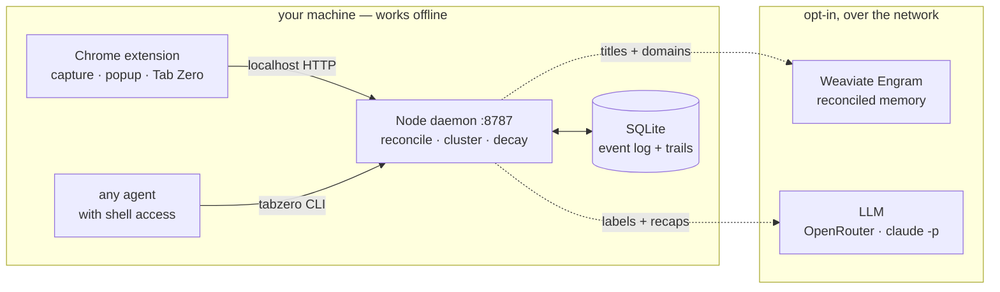

<div align="center">


# Tab Zero

**Close every tab guilt-free. Your browser remembers _why_ each one was open and you or your AI agent can resurrect the research trail on command.**

_Reconciled memory powered by [Weaviate Engram](https://weaviate.io/product/engram)._


</div>

---

Tab Zero watches your tab stream, reconciles it into semantic **research trails** and lets you:

- **Reach Tab Zero** — nuke every open tab in one click. Nothing is lost; every trail stays reconstructable.
- **Resurrect** — reopen the exact tab constellation of any past trail, with a recap of _where you left off and what you concluded_.
- **Search by meaning** — type to filter instantly; press Enter to search your whole memory semantically. Results are tagged `TEXT` (your words matched) or `MEANING`.
- **Research interests** — the themes you keep returning to _across_ trails, synthesized by Engram. Not "a trail you visited twice".
- **Query it from your agents** — a `tabzero` CLI exposes your browsing memory to Claude Code, Codex, opencode, or any agent with a shell.
- **Your week in tabs** — deepest rabbit hole, most-abandoned trail, 3am incident, etc.

The exact-reopen source of truth is a local SQLite log; the reconciled, evolving memory lives in **Weaviate Engram**.

<div align="center">

</div>

---

## How it works



- **Local layer** (SQLite) = instant trails + exact-reopen truth + decay. Runs in real time, fully offline.
- **Engram** = cross-time reconciliation (one bounded, evolving memory per trail) + semantic recall + agent-queryable memory. Catches up asynchronously.
- The **LLM** (OpenRouter, or your local `claude -p`) only names trails and writes recap summaries at times, never in the hot path.

Every heuristic — canonicalize, dedup, sessionize, cluster, decay — is math on-device.

---

## Prerequisites

- **Node ≥ 22.5** (uses the built-in `node:sqlite`) and **pnpm**.
- Optional — a **Weaviate Engram** project + API key for the memory layer. Without it, Tab Zero runs in **local mode**: trails, keyword search, categories, gated interests, and "your week in tabs" all still work.
- Optional — an **LLM** for prose. If `OPENROUTER_API_KEY` is set it's used; otherwise Tab Zero shells out to a local **`claude`** (`claude -p`) if installed; otherwise it falls back to heuristic labels/summaries.

---

## Quick start

```bash
npx github:prajjwalyd/TabZero
```

Tab Zero isn't on npm — `npx` installs straight from this repo and a `prepare` script compiles it on your machine. A wizard stages the extension, takes a [Weaviate Engram key](docs/engram.md), and starts the daemon. Then:

1. Open `chrome://extensions` (Chrome, Edge, Brave, Arc…) and enable **Developer mode**
2. **Load unpacked** → the folder the wizard prints (`~/.tabzero/extension`)
3. Pin **Tab Zero**, click it, and browse a bit — trails appear automatically

No key needed to start. Setup also offers to install `tabzero` as a bare command, so after that it's just
`tabzero start` · `key` · `path` · `help`.

### Updating

| Component | Process |
|---|---|
| Daemon + CLI | re-run `npx github:prajjwalyd/TabZero` — npx re-resolves the git ref, so you always get the newest commit |
| Extension | **not automatic** — `tabzero setup` re-stages it, then hit ↻ at `chrome://extensions` |

Unpacked extensions never auto-update, so move both halves together: a new daemon behind an old extension is the one combination that breaks. `GET /health` reports `version` if you want to check.

### Uninstalling

`tabzero uninstall` stops Tab Zero running and **keeps every trail** — reinstalling resumes from the same database, the same Engram memories, and the same saved key. Add `--purge` to erase that data instead (`--yes` skips the confirmation, and is the only way to script it).

### Run from source

```bash
pnpm install             # also builds, via the same `prepare` script
pnpm backend             # start the daemon (keep it running)
```

Load unpacked from `extension/dist` instead. Dev loop: `pnpm watch:ext` + `pnpm backend:dev`. The `tabzero` command works from a clone too — `node bin/tabzero.js setup` runs `npm link` for you.

Clone only to *develop* Tab Zero; to use it, the one-liner above is the whole story.

| Command | Description |
|---|---|
| `pnpm seed` | realistic demo trails for screenshots (`--reset` wipes first, `--enrich` runs the LLM pass) |
| `pnpm reset` | wipe the local DB — new `user_id`, clean Engram scope |
| `pnpm repair` | fix a DB from an older build; dry run by default, `--apply` writes after backing up |
| `pnpm test` | hermetic suite · `pnpm test:e2e` runs the full lifecycle against real LLM + Engram |

---

## Connect Engram

Engram turns Tab Zero's memory from local placeholders into a **reconciled, evolving, semantic** layer. Full setup (project + the two topics + descriptions to paste) is in **[docs/engram.md](docs/engram.md)** — the short version:

Create two topics at [console.weaviate.cloud/engram](https://console.weaviate.cloud/engram):

| Topic | User-scoped | Property scope | Bounded | Role |
|---|:---:|---|:---:|---|
| `TrailSummary` | ✅ | `trail_id` | ✅ | one evolving recap per trail |
| `ResearchInterest` | ✅ | _(none)_ | ✅ | durable cross-trail interests |

Then `tabzero key`, paste your `eng_…` key, and restart the daemon. The popup's status-dot tooltip will read `engram on`, search results tagged **MEANING** (green) are coming from Engram, and the **Interests** tab fills in as Engram synthesizes themes across your trails.

---

## Use your browsing memory from any agent

There's no plugin to install and nothing to restart: any agent with shell access can query your trails through the `tabzero` command. Point it at these once (a line in `CLAUDE.md`, `AGENTS.md`, or your system prompt) and it can pull your browsing memory on demand.

| Command | What it does |
|---|---|
| `tabzero search [query]` | Natural-language search over your trails (empty query lists all) |
| `tabzero trails [--all]` | Every trail, newest first; `--all` also includes archived (quiet >30 days) |
| `tabzero trail <id\|query>` | One trail's recap + its page list |
| `tabzero resurrect <query>` | Recap + the exact URLs to reopen, from a query or id |
| `tabzero week` | The vanity stats (rabbit holes, abandoned trails, 3am incidents…) |
| `tabzero interests` | The durable themes you keep returning to across many trails |

Add `--json` to any of them for machine-readable output:

```bash
tabzero search "gpu pricing" --json
```

They query the running daemon over HTTP, so it has to be up — which it is anyway, or nothing is being captured. A failure is a non-zero exit and a message on stderr, never a silent empty result.

Try it with any agent: _"resurrect my GPU pricing research"_ · _"what's my most abandoned trail this week?"_ · _"what have I been into lately?"_

---

## Configuration

Env vars (all optional). A real environment variable always wins; otherwise they load from `.env` — at the
repo root when you're running a checkout, from `~/.tabzero/.env` when installed. Which one applies depends on
where the *code* lives, not which directory you launch from, so `npx github:prajjwalyd/TabZero` inside a clone
still uses `~/.tabzero`.

| Var | Default | Purpose |
|---|---|---|
| `ENGRAM_API_KEY` | — | Weaviate Engram key (reconciled memory) — [setup guide](docs/engram.md) |
| `OPENROUTER_API_KEY` | — | Use OpenRouter for the LLM instead of local `claude` |
| `OPENROUTER_MODEL` | `deepseek/deepseek-v4-flash` | Chat model when using OpenRouter |
| `TABZERO_CLAUDE_MODEL` | `haiku` | Model alias for the local `claude -p` path |
| `TABZERO_USER_ID` | _(generated)_ | Pin the user / Engram scope; bump it for a clean slate |
| `TABZERO_TRAIL_TOPIC` | `TrailSummary` | Match a differently-named recap topic |
| `TABZERO_INTEREST_TOPIC` | `ResearchInterest` | Match a differently-named interest topic |
| `TABZERO_PORT` | `8787` | Daemon port — also set `BACKEND` in `extension/src/config.ts` and rebuild |
| `TABZERO_TOKEN` | _(generated)_ | Pin the extension↔daemon secret; by default a random one is minted per install into `<data dir>/token` |
| `TABZERO_ENGRAM_TIMEOUT_MS` | `15000` | Hard cap on any Engram call so a slow endpoint can't hang the daemon |
| `TABZERO_DEBUG` | — | Set to `1` for verbose Engram retrieval logs |
| `TABZERO_RESURRECT_MAX_TABS` | `25` | Hard cap on how many tabs one **Resurrect** may reopen |
| `ENGRAM_BASE` | `https://api.engram.weaviate.io/v1` | Engram API base. **Must be `https://`** (loopback excepted) — it's validated at boot, because every request carries your API key alongside your page titles |

Data lives in `./.tabzero/tabzero.db` (SQLite, WAL) in dev, or `~/.tabzero/tabzero.db` when installed.

---

## Repo layout

```
server/src/
  index.ts     daemon entrypoint (HTTP + scheduler)     cli.ts  the `tabzero` command
  core/        config · db (schema) · types · llm       daemon/ http (localhost API) · scheduler
  capture/     canonical (URL + lexical vectors) · redact (privacy) · pipeline (ingest → cluster)
  trails/      trails (decay, labels, recaps, search) · categories · checkpoint ("tab zero")
  engram/      client (REST) · sync (settle-gated enrichment + flush)
  scripts/     seed (demo data) · reset (clean slate) · repair (fix an old DB)
extension/src/ background (capture) · popup · content · zero — TypeScript, bundled by esbuild
server/test/ + extension/test/   hermetic, every assertion mutation-verified
docs/        engram.md · images/
```

Reading order and the reasoning behind each design decision are in the code comments — they document *why*, including the bugs that shaped them.

---

## Security & privacy

**Nothing leaves your machine except page titles, domains, and the public preview text sites already publish** (OpenGraph / meta description / the visible `h1`) — sent only to *your own* Engram project, only with a key. Never screen recordings, never page bodies, never anything you typed. Raw URLs and the event log stay local.

The daemon needs all four of these, and each covers what the others don't:

- binds **`127.0.0.1` only**, never `0.0.0.0`
- a **per-install random token** (`randomUUID`, `0600`) on every route but `/health`
- **no CORS headers**, so a web page can send a request but not read the reply
- a **`Host` allowlist** — this is what stops **DNS rebinding**, where a page on `evil.com` re-resolved to `127.0.0.1` arrives *same-origin* and CORS is never consulted. Without it, "no CORS" alone would have let any page read `/health` and take the token. Pinned by `server/test/http.test.ts`.

On disk the data dir is `0700` and the DB, its `-wal`, the token and `.env` are `0600`, re-applied every start. `ENGRAM_BASE` must be `https://` — checked at boot, since every request carries your key alongside your titles. Bodies cap at 4MB. **Anything holding the token can read and write your trails — treat it like a credential.**

A redaction layer sits in front of capture, separate from URL canonicalization (which is a dedup key, never a privacy filter):

- **Auth flows are never captured** — sign-in, OAuth, password reset, email verification, checkout.
- **Secrets are stripped from the rest** — `?token=`, `?code=`, `?email=`, session ids, presigned signatures, high-entropy values, and the same patterns inside *titles*. Search queries are kept on purpose: they're the most useful signal a trail has.
- **Titles are scrubbed again before any LLM or Engram call** — addresses, JWTs, card-shaped numbers, encoded blobs — leaving the topic intact, since a recap without specifics is worthless. They're also treated as untrusted input in every prompt: a site picks its own title, and the recap it could poison is one your agents later read.
